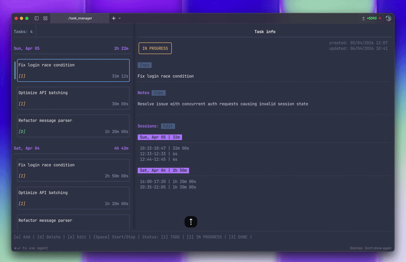

# TUI Terminal Time Tracker

A keyboard-driven, terminal-based task and time-tracking application built with **C++23**, **FTXUI**, and **SQLite**.



## Features

- **Task management** — create, edit, and delete tasks with a title and description
- **Time tracking** — start/stop work sessions per task; sessions are stored with precise timestamps
- **Timesheet view** — entries grouped by day with per-day and per-task totals
- **Task statuses** — `TODO`, `IN PROGRESS`, `DONE` with color-coded badges
- **Session editing** — review and delete individual sessions from the info panel
- **Persistent storage** — all data saved locally in a SQLite database (`tasks.db`)
- **Live timer** — active session duration updates every second

## Keyboard Shortcuts

| Key       | Action                          |
|-----------|---------------------------------|
| `↑` / `↓` | Navigate tasks                  |
| `Space`   | Start / stop time tracking      |
| `a`       | Create a new task               |
| `e`       | Edit selected task              |
| `d`       | Delete selected task            |
| `1`       | Set status → TODO               |
| `2`       | Set status → IN PROGRESS        |
| `3`       | Set status → DONE               |
| `Esc`     | Close modal                     |
| `q`       | Quit                            |

## Requirements

| Tool    | Version  |
|---------|----------|
| CMake   | ≥ 4.1    |
| C++ compiler | C++23 (Clang / GCC) |
| Git     | for FetchContent |

> SQLite and FTXUI are bundled or fetched automatically — no manual installation needed.

## Build & Run

```bash
cmake -B build -DCMAKE_BUILD_TYPE=Release
cmake --build build
./build/task_manager
```

The database file `tasks.db` is created in the working directory on first launch.


## Tech Stack

- **[FTXUI](https://github.com/ArthurSonzogni/FTXUI)** — functional terminal UI framework (fetched via CMake)
- **SQLite** — embedded relational database (bundled as a single-file amalgamation)
- **C++23** — ranges, `std::jthread`, structured bindings, `std::optional`
